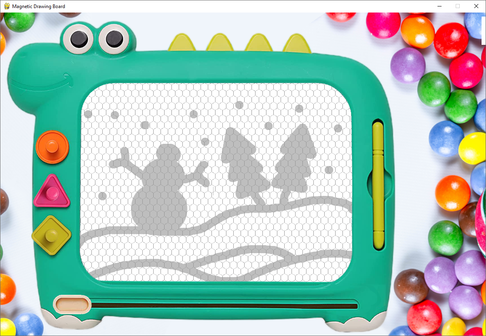
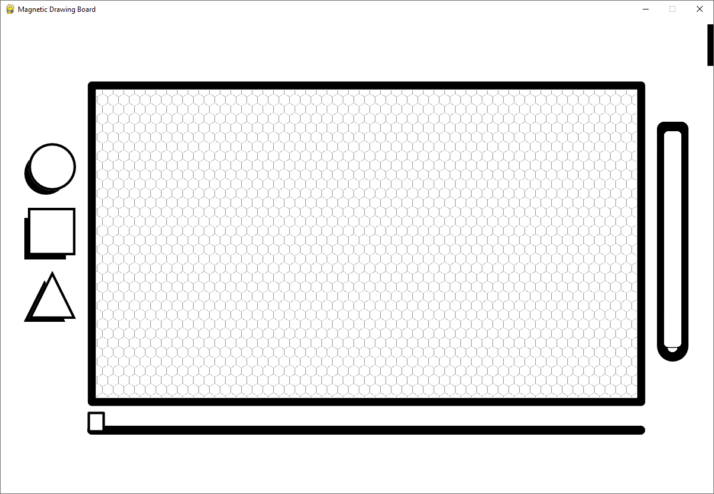
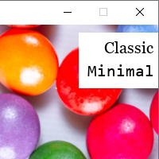
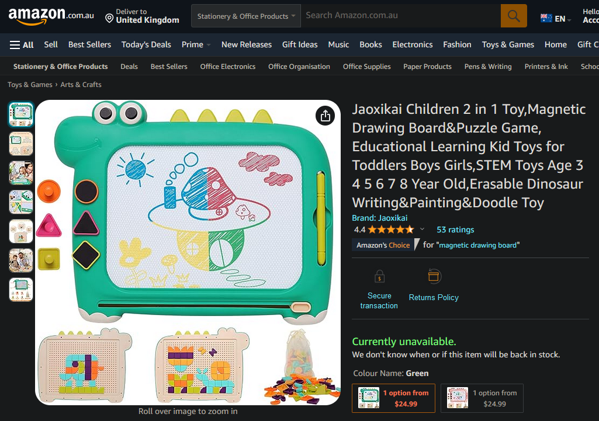

# Magnetic Drawing Board

<br>
<div align="center">
     
</div>
<br>
<div align="center">
     
</div>
<br>

<div align="center">
    ,   
</div>
<br>


https://github.com/K4KarolE/Magnetic_Drawing_Board/assets/89346643/0f077c8e-b8e3-47d5-b930-7b66317accf2


# Source used ([link](https://www.amazon.com.au/WELHAEPI-Children-Magnetic-Educational-Learning/dp/B0991P61JX?th=1))
<div align="center">
     
</div>
<br>


# Requirements
## Python and Modules
### Install packages\dependencies
```
pip install -r requirements.txt
```
### Separately
### Python 3 - used: 3.11
- https://www.python.org/

### Pygame
- https://www.pygame.org
- https://pypi.org/project/pygame/

## Others
### OS
- `Windows` (tested on 10)

# Guide
- Pick up a drawing shape(`circle`, `square`, `triangle`, `pen`):
    - move the cursor over a shape listed above, the default arrow cursor will be changed to hand, left-click once and the shape will be picked up
    - left-clicking again will drop the shape back to the original position (even if the shape was previously rotated)
        - to drop/place back the current shape the cursor has to be in the same shape specific spot where the shape was picked up
    - not able to pick up a new drawing shape until the current one is not placed back
    - not able to use the `eraser` slide until any of the drawing shapes is selected/picked up
    - able to switch skins when a drawing shape is selected/picked up
- Drawing:
    - once a drawing shape is picked up move over the drawing surface and left-click
    - hold the button down and move the cursor for continuous drawing
- Shape rotation:
    - able to rotate the `square` and `triangle` drawing shapes anywhere in the app
    - middle-click will rotate the shape left with 10°
    - right-click will rotate the shape right with 10°
- Skins:
    - The app starts with the default skin: `Classic`
    - The skin menu is visible once the cursor reaching the right top corner
        - able to switch between the sknins any time, by doing so:
            - The current drawing will be lost
            - The current drawing shape will be dropped

# Modules used, which are part of Python 3.11
- json
- os
- pathlib
- sys

## Thank you all the contributors of Pygame and the modules listed in this document!
